

# Alzheimer’s EHR Bottleneck Analysis

  <a href="./README.md">한국어</a> · <strong>English</strong>

**A solo research project defining a record-based interval from the first pre-diagnostic EHR signal to the AD index date and examining starting clinical domains, observation intensity, and sensitivity to the lookback definition**

 

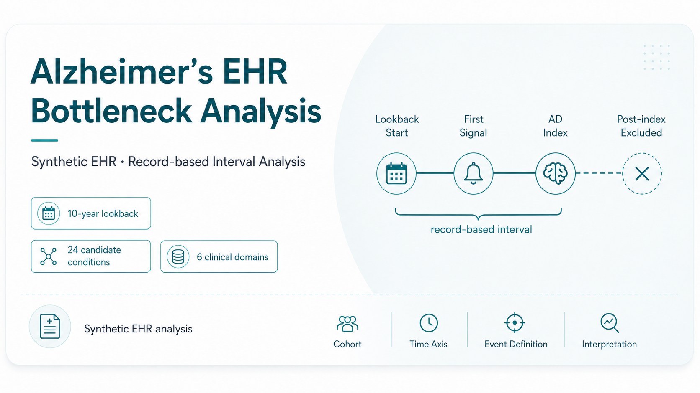

This graphic summarizes the study design and analysis workflow. The original aggregate results are shown below using figures from the presentation.

  

---

## 🧭 Study Overview

Before an Alzheimer’s disease diagnosis, EHRs may accumulate records of hypertension, diabetes, kidney disease, and other comorbidities. However, it is difficult to summarize where the pre-diagnostic pathway begins and how long it remains in the record before the diagnosis date.

Within a 10-year pre-index lookback window, the earliest record among 24 candidate conditions was defined as the **first signal**. The interval from the first signal to the Alzheimer’s disease index date was calculated as a **record-based interval**, and the condition selected as the first signal was mapped to one of six clinical domains.

The analysis did not aim to estimate the biological onset of disease. Instead, it examined where the pre-diagnostic EHR pathway began and how the record-based interval differed across patient groups.

  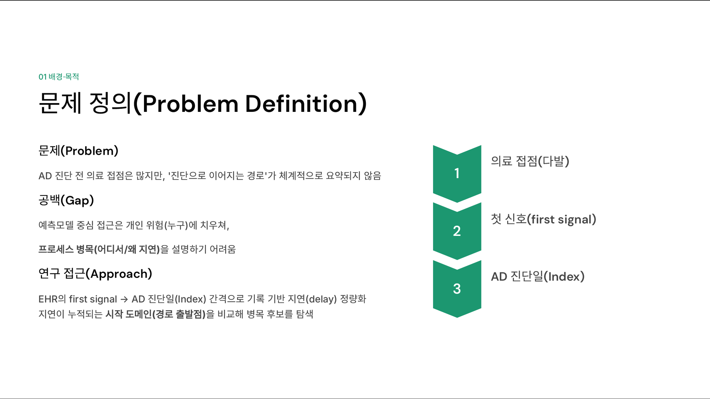

---

## ❓ Research Questions

The analysis was organized around the distribution of the interval, starting pathways, validity checks, and sensitivity to the lookback definition.

1. What is the magnitude and distribution of the record-based interval from the first signal to the AD index date?
2. How do starting clinical domains differ across short-, middle-, and long-interval groups?
3. Do the domain patterns remain after observation intensity and age are considered together?
4. How do the capture rate and interval change under 5-, 10-, and 15-year lookback definitions?

  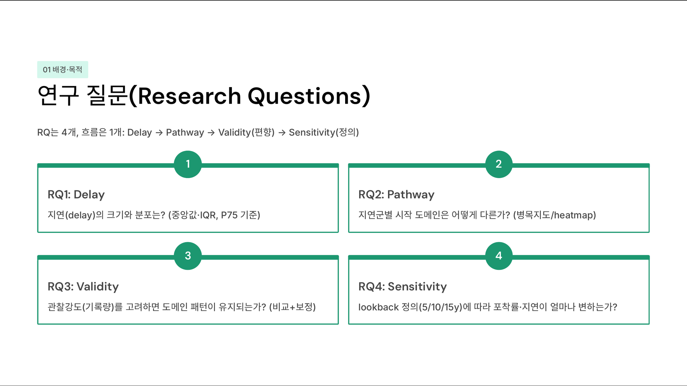

---

## ⏱️ Study Design

The Alzheimer’s disease diagnosis date was defined as the **index date**, and the 10 years before the index were used as the primary lookback window. The earliest date among 24 candidate conditions within the lookback was selected as the first signal, and `index date - first signal date` was calculated as the record-based interval.

Events recorded on or after the index date were excluded from first-signal selection so that post-diagnostic information would not be treated as a pre-diagnostic signal.

  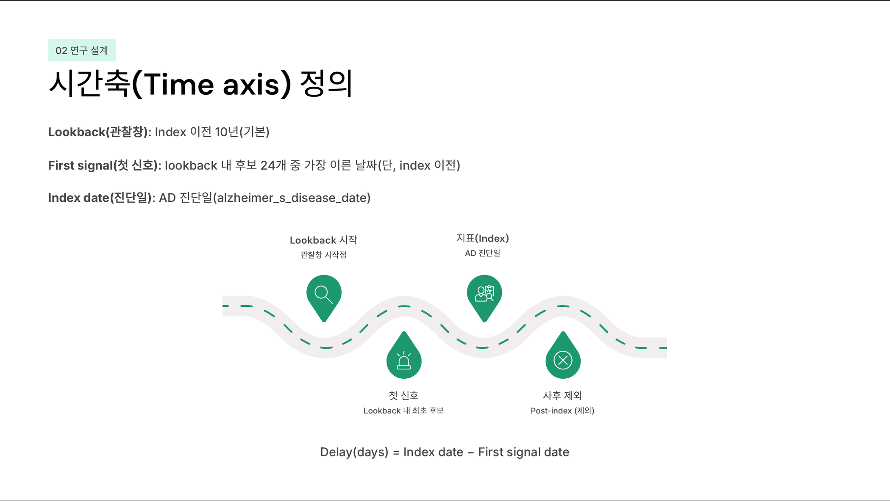

  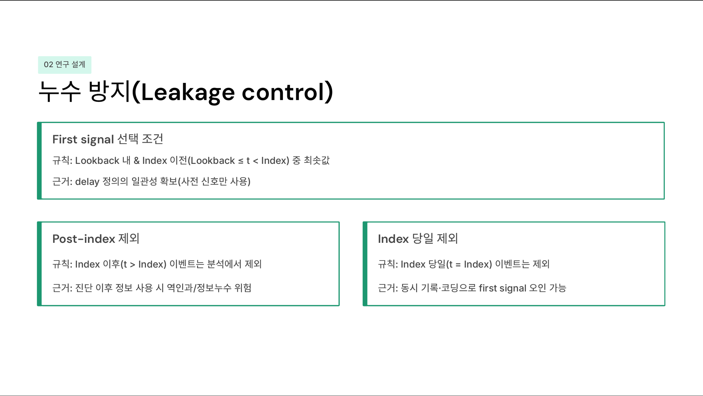

---

## 🗂️ Data and Cohort

The project used **MIMICData Dementia/Alzheimer’s synthetic EHR** provided through the COMPASS platform. Among 3,000 records, 1,287 patients had Alzheimer’s disease marked as Yes and a valid diagnosis date. A first signal was captured within the 10-year lookback for 893 patients, corresponding to a capture rate of 69.4%.

The 24 candidate conditions were mapped to six clinical domains to maintain a consistent unit of interpretation.

- **Cardiovascular:** hypertension, ischemic heart disease, and related conditions
- **Metabolic:** type 2 diabetes, dyslipidemia, and related conditions
- **Renal:** chronic kidney disease, end-stage renal disease, and related conditions
- **Bone/Frailty:** osteoporosis, fractures, and related conditions
- **Mental:** anxiety, panic, depression, and related conditions
- **Hematology:** anemia and related conditions

  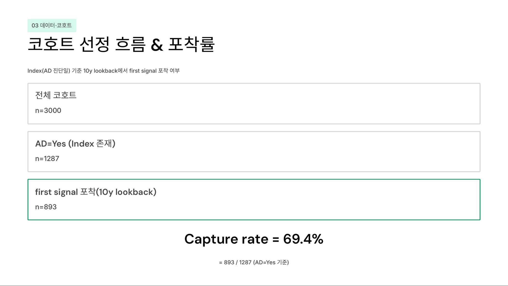

---

## 🧪 Methods

The analysis followed five steps: cohort definition, first-signal extraction, interval calculation, clinical-domain mapping, and validity checks.

The 10-year interval distribution was divided using quartile cutoffs.

- **Short:** 1,258 days or less
- **Middle:** more than 1,258 and less than 2,968 days
- **Long:** 2,968 days or more

The number of candidate events recorded within the lookback was defined as **observation intensity (event count)**. A logistic regression model used Long-group status as the outcome and included starting domain, event count, and age. Sensitivity analyses were also conducted using 5-, 10-, and 15-year lookback windows.

  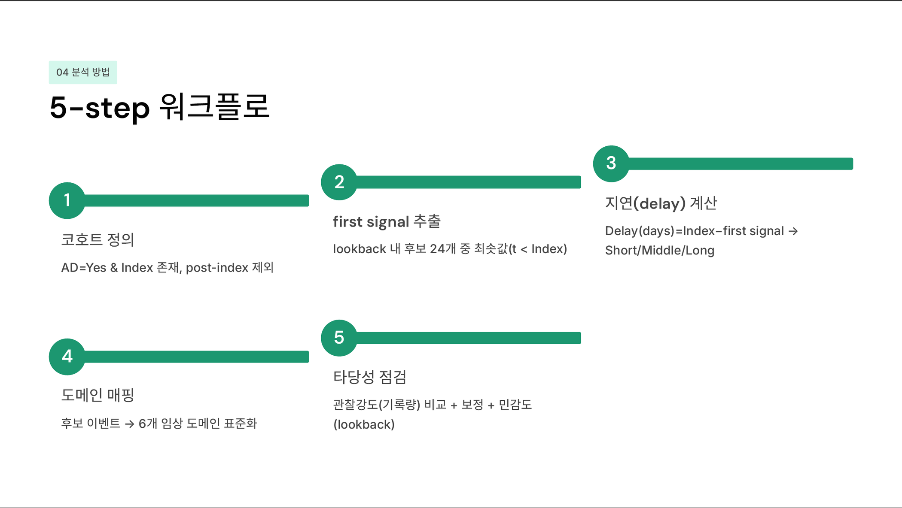

---

## 📊 Results

### Record-Based Interval Distribution

Among the 893 patients with a captured first signal in the 10-year lookback, the median record-based interval was **2,198 days (approximately 6.0 years)**. The IQR was **1,258-2,968 days**, and intervals of 2,968 days or more were classified as Long.

  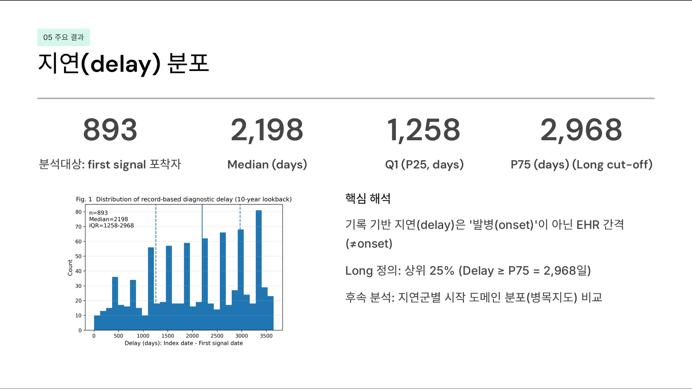

### Starting-Domain Patterns

Relative differences were observed in the composition of starting domains across interval groups.

- **Short group:** Bone/Frailty and Mental domains were relatively more common.
- **Long group:** Renal and Metabolic domains increased in relative proportion.
- **Cardiovascular:** remained a major starting domain across all interval groups.

  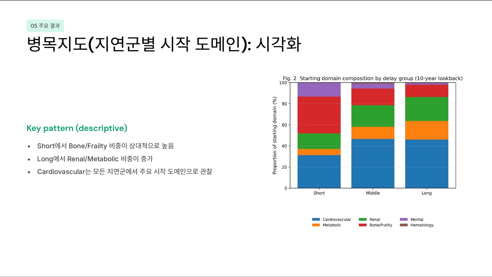

### Observation Intensity

The mean number of candidate events was **1.53** in the Short group and **3.12** in the Long group. Because the first signal was defined as the earliest eligible date, patients with more recorded candidate events had more opportunities for an earlier date to be selected. Observation intensity was therefore examined alongside the interval results.

  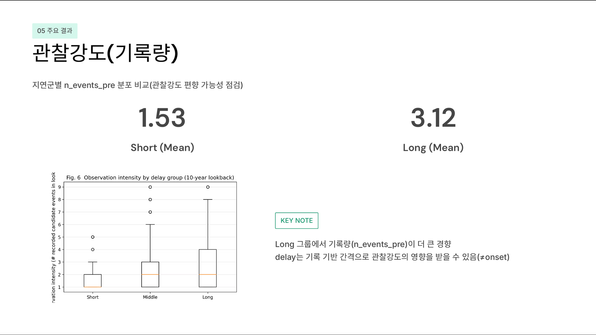

### Adjusted Analysis

A logistic regression model was fitted with Long-group status as the outcome and starting domain, event count, and age as predictors. Higher event count was associated with an increased likelihood of being observed in the Long group, while some domain differences remained after adjustment.

  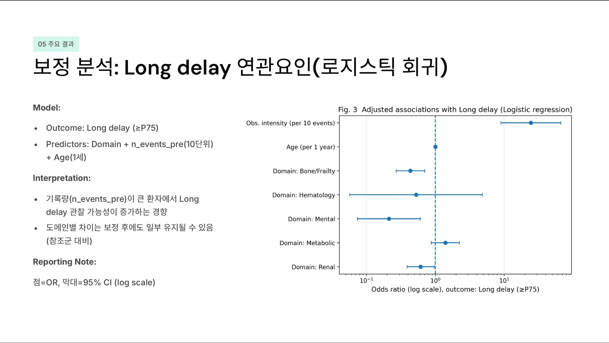

### Sensitivity Analysis

Longer lookback windows increased the first-signal capture rate and also extended the range from which an earlier record could be selected, resulting in a higher median record-based interval.

| Lookback | First-signal capture rate | Median record-based interval |
|:---:|---:|---:|
| 5 years | 49.0% | 1,113 days |
| 10 years | 69.4% | 2,198 days |
| 15 years | 82.1% | 3,412 days |

<table>
  <tr>
    <td width="50%" align="center">
      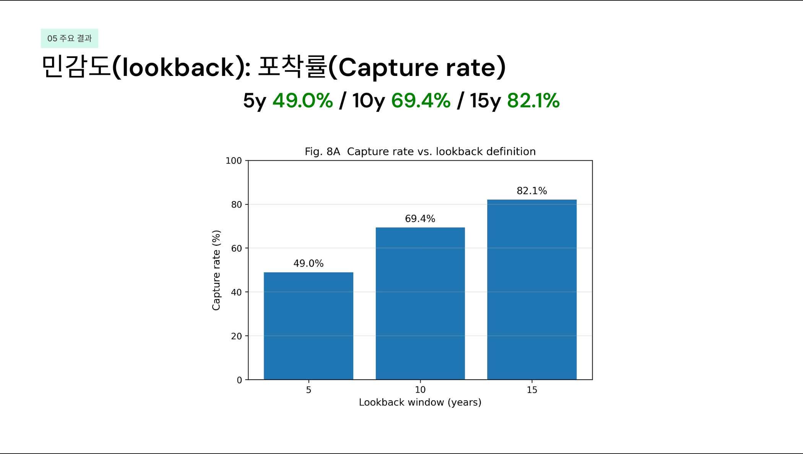
       
      First-Signal Capture Rate
    </td>
    <td width="50%" align="center">
      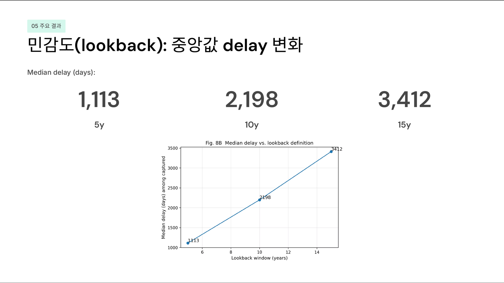
       
      Median Record-Based Interval
    </td>
  </tr>
</table>

---

## 🔍 Interpretation

The Short and Long groups differed in the relative composition of their starting clinical domains. However, because the first signal was defined as the earliest recorded event, patients with more candidate-condition records had a greater opportunity for an earlier date to be selected.

The Long group had higher pre-index event counts, and both the capture rate and median interval changed when the lookback window was modified. The interval was therefore interpreted as an **EHR-based, definition-dependent measure**, rather than a direct estimate of the time from biological onset to clinical diagnosis.

A central contribution of the project was to evaluate not only the statistical patterns, but also how cohort construction, time-axis definition, observation intensity, and sensitivity to the analytic window shaped those patterns.

---

## 🎤 Presentation and Award

<table>
  <tr>
    <td width="50%" align="center">
      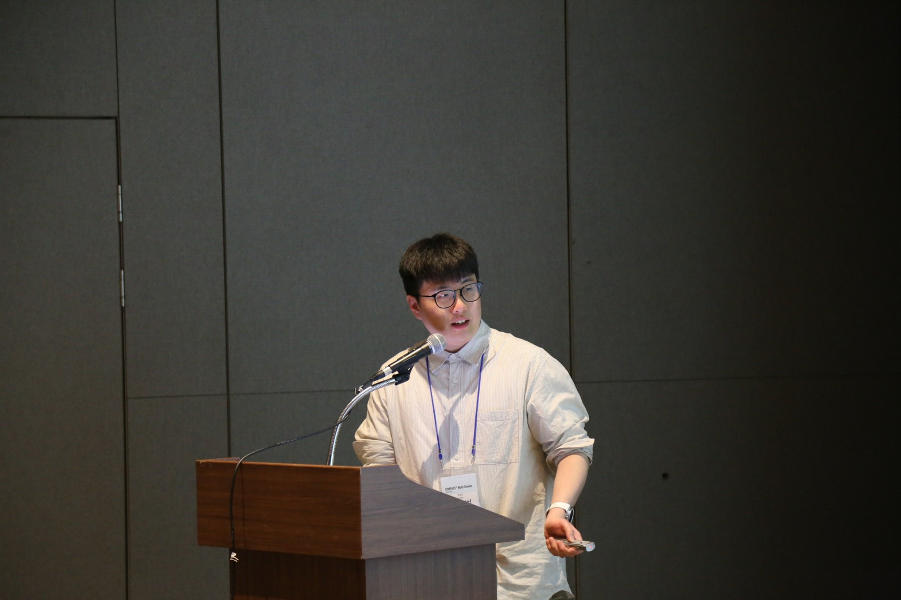
       
      Oral Presentation
    </td>
    <td width="50%" align="center">
      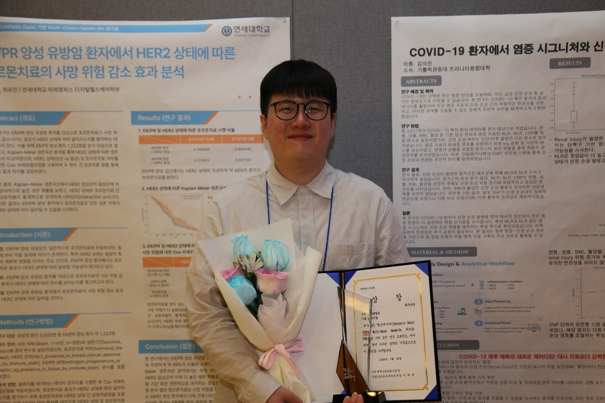
       
      Grand Prize, Oral Presentation Category
    </td>
  </tr>
</table>

---

## 📎 Project Materials

| Material | Link | Description |
|:---|:---|:---|
| Presentation | [2026 Multi-Omics Hands-On Presentation](./materials/2026-multi-omics-presentation.pdf) | Research questions, time axis, cohort, methods, and results |
| Poster | [2026 Multi-Omics Hands-On Poster](./materials/2026-multi-omics-poster.pdf) | Summary of study design and findings |
| Abstract | [Oral Presentation Abstract](./materials/2026-multi-omics-abstract.pdf) | Background, methods, results, and conclusion |
| Award | [Grand Prize Certificate](./materials/2026-multi-omics-award.pdf) | Awarded on January 23, 2026 |
| Official coverage | [Gangwon LRS Shared University](https://www.gwlrs.ac.kr/ko/news/press/view/360?p=1) | Event and project showcase coverage |
| Additional coverage | [Lecturer News](https://www.lecturernews.com/news/articleView.html?idxno=195955) · [Enews Today](https://www.enewstoday.co.kr/news/articleView.html?idxno=2385680) · [Kyosu Newspaper](https://www.kyosu.net/news/articleView.html?idxno=156225) | Coverage of the workshop and student research presentations |

This public repository presents the study design, aggregate results, presentation materials, and event records. The source dataset is not redistributed.

---

## 👤 Project and Recognition

| Category | Details |
|:---|:---|
| Project format | Solo project |
| Role | Research question formulation, time-axis and first-signal definition, cohort construction, clinical-domain mapping, statistical analysis, interpretation, and oral presentation |
| Event | Synthetic Data-Based Multi-Omics Hands-On Workshop |
| Recognition | Grand Prize, Oral Presentation Category |

**Solo Project · Research & Analysis · Grand Prize (Oral Presentation), 2026**

